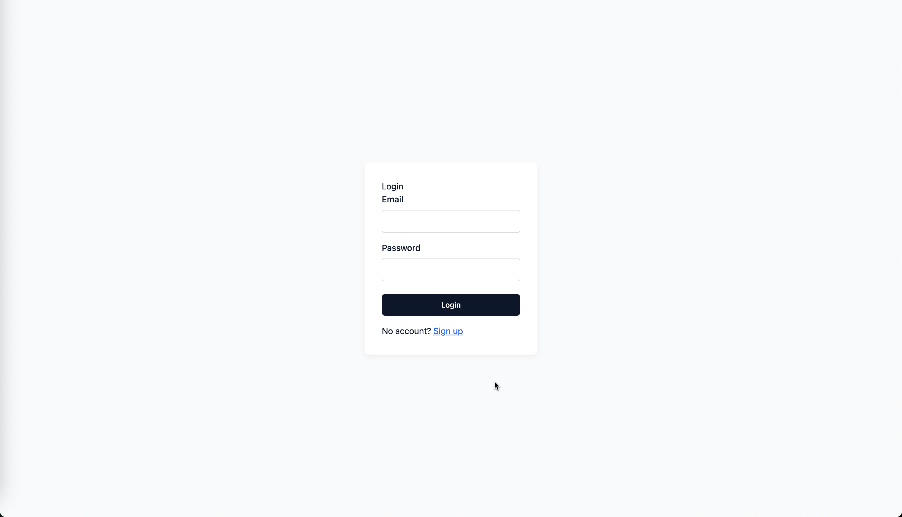
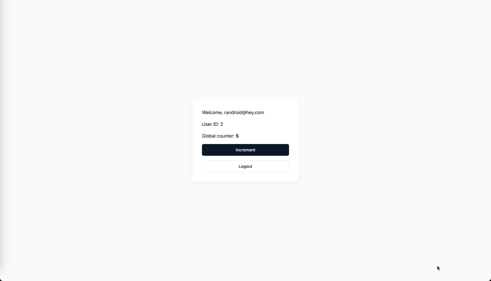

# Codex Full-Stack Bootstrap

> 🤖 This entire project was generated with Codex and the o3-2025-04-16 reasoning model from OpenAI.

A tiny, batteries-included starter that shows how to glue a React front-end, a FastAPI back-end and a Node.js auth service together – all orchestrated with Docker Compose.

## Stack

• PostgreSQL & Redis for data and caching  
• **auth-server** – Node.js / Express, issues JWT access & refresh tokens  
• **backend** – FastAPI + SQLModel, protected API example  
• **frontend** – React 18, Vite, TypeScript, TailwindCSS + shadcn/ui, React-Router

## Screenshots

| Login | Dashboard |
|-------|-----------|
|  |  |

## Running services / endpoints

• http://localhost:3000 – React front-end  
• http://localhost:8000/docs – FastAPI interactive docs  
• http://localhost:4000/health – Auth-server health probe

